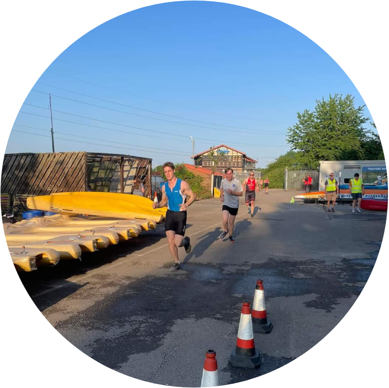

<p align="center">

</p>

##

<h3 align="center">I'm Sam</h3>
<h5 align="center">I’m a classically trained musician, triathlete, now ex-pizza chef and the final ingredient to becoming a full-stack person was learning full-stack development with the School of Code.
</h5>
<h6 align="center">⬇ Ooop, well here I am, just right below ⬇</h6>
<p align="center">

</p>
<h6 align="center">🐼 I forgot to mention, I'm big into KFP 🐼</h6>
<p align="center">

<h6 align="center">👨‍💻 Anyway, here's my info... 👨‍💻</h6>

##
<h2 align="center">My Stats</h2>
<p align="center">


</p>
<p align="center">

</p>
<p align="center">

</p>
<p align="center">


<h2 align="center">My Stack</h1>
<p align="center">
    
    
    
    
    
    
    
    
    
    
    
    
    
</p>
<h2 align="center">Get in Touch or Follow my Journey</h2>
<p align= "center">
<a href="https://www.linkedin.com/in/samwilliamson2918/"></a>
<a href="https://medium.com/@szwilliamson01"></a>
<a href="https://twitter.com/WilzoCodes"></a>
</p>
<h2 align="center">My Data</h1>


```yaml
{
fullName: "Samuel Williamson",
usernames: ["sam98963", "WilzoCodes", "sidzilla09"],
currentOccupation: "Full-stack developer at School of Code",
education: [
"Bachelor's in Music - University of Manchester",
"Software Engineering Bootcamp - School of Code"
],
fieldsOfInterest: [
"Web Development",
"Game Developement",
"LLMs and Machine Learning",
"Cloud Engineering",
"UI and UX",
"VR and AR"],
currentlyLearning: [
"Docker", 
"AWS (localstack)",
"Typescript"
],
goalsForThisYear: [
"Complete First Triathlon (16/07/23)",
"Land First Role as a Developer",
"Release First Commercial App",
"AWS certification"
],
socialMedia: [
"LinkedIn - my life",
"Twitter - 100 days of code and triathlon training",
"Medium - personal blog"
]
hobbies: [
"Trumpet",
"Guitar",
"Run, Cycle, Swim (Triathlon)",
"Football",
"Gaming",
"Hiking"
]
}

```


